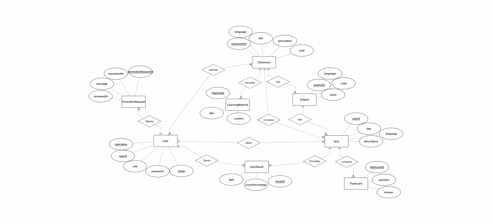
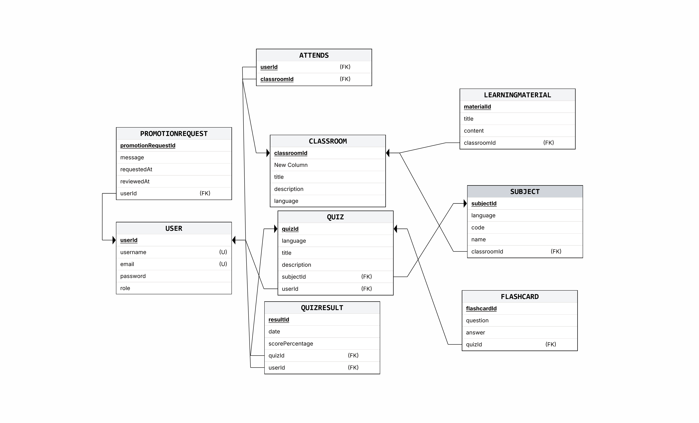

# ONLINE FLASHCARDS

This is the second year Software Engineering project. The application is a quiz learning platform where the main learning method is flashcard learning.

## PRODUCT DESCRIPTION

**OnlyCards** is a web-based quiz and flashcard learning platform designed for students and educators. Users can create, share, discover, and study flashcard quizzes across a variety of subjects — all through a modern, responsive single-page application.

### Core Features

#### Authentication & User Roles

The platform supports three user roles with increasing privileges:

- **Student** — the default role. Can browse, search, and play quizzes, join classrooms, and view results.
- **Teacher** — a promoted role. Can do everything a student can, plus create and manage quizzes and classrooms.
- **Admin** — has full administrative privileges, including approving or rejecting promotion requests and managing all users and classrooms.

Users register with a username, email, and password. Authentication is handled via **JWT tokens**, so sessions are stateless and secure. Students who want to create content can submit a **promotion request** to be upgraded to the Teacher role, which an Admin can then approve or reject.

#### Quizzes & Flashcards

The central learning unit is the **quiz**, which is a named collection of **flashcards**. Each flashcard has a question side and an answer side. Quizzes are categorized by **subject** (e.g. Mathematics, History) for easy filtering.

Teachers create quizzes by giving them a title, description, subject, and then adding individual flashcards. Quizzes are publicly searchable and playable by all users.

#### Quiz Game

When a user plays a quiz, they are presented with flashcards one at a time in an interactive **flip-card** UI. The user reads the question, mentally answers, then flips the card to reveal the correct answer and self-evaluates. Navigation between cards is animated with sliding transitions. After completing all cards, the result (score percentage) is recorded and the user is taken to a **results page**.

#### Quiz Results & Progress Tracking

Each quiz attempt is saved as a **quiz result**, recording the score percentage and timestamp. This allows users to track their learning progress over time and revisit quizzes to improve.

#### Search & Discovery

The **Search Quizzes** page lets any visitor — authenticated or not — browse and search the full library of community-created quizzes. Quizzes can be filtered by subject. Each quiz card shows the title, creator, subject, and flashcard count.

#### Classrooms

Teachers and Admins can create **classrooms** — virtual study groups organized around a subject. A classroom has:

- A **title**, **description**, and optional **note**
- A **join code** that students use to enroll
- **Quizzes** assigned to the classroom for guided study
- **Learning materials** (text-based resources) uploaded by the owner
- A **members list** managed by the owner

Classroom owners can add or remove members, attach quizzes, and upload learning materials. Students can join using the code, view all classroom content, and leave at any time.

#### Profile Management

Authenticated users have a **profile page** where they can:

- View their username, email, and role
- Edit their profile (change username, email, or password)
- Submit a promotion request (Student > Teacher)
- See quick links to their quizzes and classrooms

## TECHNOLOGIES USED

### Frontend
| Technology | Purpose |
|---|---|
| **React 19** | UI library |
| **Vite 7** | Build tool & dev server |
| **i18next** + **react-i18next** | Frontend internationalization and localization |
| **Tailwind CSS 4** | Utility-first CSS framework |
| **React Router 7** | Client-side routing |
| **React Hook Form** + **Zod** | Form handling & validation |
| **Lucide React** | Icon library |
| **Nginx** | Production static file serving & reverse proxy |

### Backend

| Technology                          | Purpose                        |
| ----------------------------------- | ------------------------------ |
| **Java 17**                         | Programming language           |
| **Spring Boot 4**                   | Application framework          |
| **Spring Security**                 | Authentication & authorization |
| **Spring Data JPA** / **Hibernate** | ORM & database access          |
| **JWT (jjwt)**                      | Token-based authentication     |
| **Jackson**                         | JSON serialization             |
| **SpringDoc OpenAPI**               | API documentation (Swagger UI) |
| **Maven**                           | Build & dependency management  |

### Database

| Technology     | Purpose             |
| -------------- | ------------------- |
| **MariaDB 11** | Relational database |

### Testing

| Technology                     | Purpose                            |
| ------------------------------ | ---------------------------------- |
| **Vitest** + **jsdom**         | Frontend unit testing              |
| **React Testing Library**      | Component testing                  |
| **V8 Coverage**                | Frontend code coverage             |
| **JUnit 5** (Spring Boot Test) | Backend unit & integration testing |
| **JaCoCo**                     | Backend code coverage              |

### DevOps & Deployment

| Technology         | Purpose                       |
| ------------------ | ----------------------------- |
| **Docker**         | Containerization              |
| **Docker Compose** | Multi-container orchestration |
| **Jenkins**        | CI/CD pipeline                |
| **Docker Hub**     | Container image registry      |
| **Railway**        | Cloud hosting & deployment    |

### Code Quality

| Technology        | Purpose                             |
| ----------------- | ----------------------------------- |
| **ESLint 9**      | Frontend linting                    |
| **Prettier**      | Code formatting                     |
| **SonarQube**     | Static code analysis & quality gate |

## CI/CD PIPELINE

The project uses a **Jenkins declarative pipeline** (`Jenkinsfile`) that automates building, testing, and containerizing the application. The pipeline runs on a **Windows** Jenkins agent and uses `bat` commands throughout.

### Pipeline Overview

```
Checkout & Setup ➜ Build & Test (parallel) ➜ Build Docker Images ➜ Cleanup
```

### Pipeline Stages

| Stage                     | Description                                                                                                                                                 |
| ------------------------- | ----------------------------------------------------------------------------------------------------------------------------------------------------------- |
| **Setup & Checkout**      | Clones the repository via `checkout scm` and injects the `.env` credentials file from Jenkins into the workspace root                                       |
| **Backend** _(parallel)_  | Spins up a MariaDB container (`docker compose up -d --wait db`), then runs `mvnw.cmd clean package` which compiles, tests, and packages the Spring Boot JAR |
| **Frontend** _(parallel)_ | Installs dependencies (`npm ci`), runs Vitest with V8 coverage (`npm run test:coverage`), and builds the production bundle (`npm run build`)                |
| **Build Docker Images**   | Runs `docker compose build` to create production-ready images for all services                                                                              |

### Jenkins Tools

The pipeline declares three managed tools in the `tools` block:

```groovy
tools {
    nodejs 'node-20'    // NodeJS plugin – Node.js 20.x
    jdk    'jdk-21'     // JDK 21
    maven  'Maven3'     // Maven 3.x
}
```

These must be configured in **Manage Jenkins → Tools** with the exact names shown above.

### Environment & Credentials

All environment variables (database credentials, JWT secret, etc.) are stored in a **single `.env` file** managed as a Jenkins `file` credential (`flashcards-env`). During the _Setup & Checkout_ stage, the file is copied into the workspace root:

```groovy
withCredentials([file(credentialsId: 'flashcards-env', variable: 'ENV_FILE')]) {
    bat 'copy "%ENV_FILE%" .env'
}
```

Docker Compose automatically reads the `.env` file to populate service environment variables.

### Test Reporting

| Report                 | Tool             | Location                                |
| ---------------------- | ---------------- | --------------------------------------- |
| Backend unit tests     | JUnit Publisher  | `backend/target/surefire-reports/*.xml` |
| Backend code coverage  | JaCoCo Publisher | `backend/target/jacoco.exec`            |
| Frontend code coverage | HTML Publisher   | `frontend/coverage/index.html`          |

### Post-Pipeline Cleanup

The `post > always` block ensures resources are freed after every run:

```groovy
post {
    always {
        bat 'docker compose down -v || exit 0'   // stop containers & remove volumes
        cleanWs()                                  // delete the workspace
    }
}
```

### Required Jenkins Plugins

| Plugin              | Purpose                                |
| ------------------- | -------------------------------------- |
| **NodeJS**          | Provides the `nodejs` tool installer   |
| **JUnit**           | Publishes backend test results         |
| **JaCoCo**          | Publishes backend code coverage        |
| **HTML Publisher**  | Publishes the frontend coverage report |
| **Docker Pipeline** | Docker integration for building images |

---

## DOCKER SETUP

### Docker Images

| Image        | Base                            | Description                                                                               |
| ------------ | ------------------------------- | ----------------------------------------------------------------------------------------- |
| **Backend**  | `eclipse-temurin:21-jre-alpine` | Copies the pre-built `online-flashcards-api.jar` into `/app` and runs it with `java -jar` |
| **Frontend** | `nginx:stable-alpine`           | Copies the Vite `dist/` output and a custom `nginx.conf` into the container               |
| **Database** | `mariadb:11`                    | Official MariaDB image, configured entirely via environment variables                     |

### Backend Dockerfile

```dockerfile
FROM eclipse-temurin:21-jre-alpine
WORKDIR /app
COPY target/online-flashcards-api.jar app.jar
CMD ["java", "-jar", "app.jar"]
```

The JAR is built by Maven during the pipeline's _Backend_ stage **before** Docker builds the image.

### Frontend Dockerfile

```dockerfile
FROM nginx:stable-alpine
COPY dist /usr/share/nginx/html
COPY nginx.conf /etc/nginx/conf.d/default.conf
EXPOSE 80
CMD ["nginx", "-g", "daemon off;"]
```

The Vite production build (`dist/`) is created during the pipeline's _Frontend_ stage.

### Nginx Reverse Proxy (`nginx.conf`)

```nginx
server {
    listen 80;

    location / {
        root /usr/share/nginx/html;
        index index.html;
        try_files $uri $uri/ /index.html;   # SPA fallback
    }

    location /api/v1/ {
        proxy_pass http://backend:8080;      # resolves via Docker network / Railway internal networking
        proxy_http_version 1.1;
        proxy_set_header Upgrade $http_upgrade;
        proxy_set_header Connection 'upgrade';
        proxy_set_header Host $host;
        proxy_cache_bypass $http_upgrade;
    }
}
```

- **`/`** — serves the static React SPA with `try_files` fallback for client-side routing
- **`/api/v1/`** — proxies all API requests to the backend service on port `8080`

### Docker Compose Services

The `docker-compose.yaml` orchestrates three services:

| Service      | Container Name        | Ports       | Notes                                                                        |
| ------------ | --------------------- | ----------- | ---------------------------------------------------------------------------- |
| **db**       | `flashcards-db`       | `3307:3306` | MariaDB with health check, persistent `db_data` volume                       |
| **backend**  | `flashcards-backend`  | `8080:8080` | Starts only after `db` is healthy (`depends_on: condition: service_healthy`) |
| **frontend** | `flashcards-frontend` | `3000:80`   | Depends on `backend`; Nginx proxies `/api/v1/` to `http://backend:8080`      |

### Database Health Check

The database service uses a health check to ensure it is fully ready before the backend starts:

```yaml
healthcheck:
  test:
    [
      "CMD",
      "mariadb",
      "-u",
      "root",
      "-p${MYSQL_ROOT_PASSWORD}",
      "-e",
      "SELECT 1",
    ]
  interval: 10s
  timeout: 30s
  retries: 20
  start_period: 60s
```

---

## DEPLOYMENT (RAILWAY)

Production images are deployed to **[Railway](https://railway.app)** as three separate services:

| Railway Service | Source                 | Description                                          |
| --------------- | ---------------------- | ---------------------------------------------------- |
| **Frontend**    | `frontend/Dockerfile`  | Nginx serving the SPA and reverse-proxying API calls |
| **Backend**     | `backend/Dockerfile`   | Spring Boot API                                      |
| **Database**    | Railway MariaDB plugin | Managed MariaDB instance                             |

### Internal Networking

Railway services communicate over a **private internal network**. The frontend Nginx `proxy_pass` resolves the backend via Railway's internal DNS (e.g., `http://online-flashcards-backend.railway.internal:8080`). The `BACKEND_URL` environment variable is set on the frontend Railway service to configure this.

### Required Railway Environment Variables

Each service must have its environment variables configured in the Railway dashboard — the same variables that appear in the `.env` file locally (database credentials, `JWT_SECRET`, `JWT_EXPIRATION`, `BACKEND_URL`, etc.).

## Frontend Localization (i18n)

The app uses [i18next](https://www.i18next.com/) with `react-i18next` for internationalization.

### Supported languages

| Code | Language | RTL |
| ---- | -------- | --- |
| `en` | English  | No  |
| `fi` | Suomi    | No  |
| `fa` | فارسی    | Yes |
| `zh` | 普通话   | No  |

### Translation files

Translations are stored as JSON files under `public/locales/<lang>/translation.json`. The app loads them at runtime via `i18next-http-backend`.

```
public/
  locales/
    en/translation.json
    fi/translation.json
    fa/translation.json
    zh/translation.json
```

### Adding a new language

1. Add an entry to `src/config/languages.js`:
   ```js
   sv: {
     locale: 'sv_SE',
     lng: 'sv',
     label: 'Svenska',
     isRtl: false,
   }
   ```
2. Create `public/locales/sv/translation.json` with the translated strings (use `en/translation.json` as a reference).

### Using translations in components

```jsx
import { useTranslation } from "react-i18next";

function MyComponent() {
  const { t } = useTranslation();
  return <p>{t("common.loading")}</p>;
}
```

The `LanguageSwitcher` component (`src/components/ui/LanguageSwitcher.jsx`) renders a dropdown in the navbar that lets users switch languages at runtime. The selected language is detected from the browser on first load and falls back to English if unsupported.

### RTL support

Languages marked `isRtl: true` in `src/config/languages.js` (currently Farsi) require RTL layout handling in CSS. This flag is available app-wide via the `LANGUAGES` config so components can conditionally apply RTL styles.

## BACKEND LOCALIZATION (i18n)

The backend implements **server-side message localization** using Spring's built-in i18n framework. This enables the API to return error messages, validation messages, and other user-facing strings in the user's preferred language based on their **Accept-Language** HTTP header.


#### LocaleResolver Configuration

The backend uses **Spring's `AcceptHeaderLocaleResolver`** to automatically parse the **Accept-Language** header and determine the user's locale:


**Supported languages** are configured in `application.yaml`:
```yaml
app:
  i18n:
    default-language: en
    supported-languages:
      - code: en
        tag: en-UK
        label: English
      - code: fi
        tag: fi-FI
        label: Suomi
      - code: fa
        tag: fa-IR
        label: فارسی
      - code: zh
        tag: zh-CN
        label: 中文
```

- If the user's language matches a supported language, **that language is used**.
- If not, the **default language (English)** is used.

### Message Properties Files

Error messages and other localizable strings are stored in **property files** in the `backend/src/main/resources/` directory:

| File                     | Language           | Coverage                   |
| ------------------------ | ------------------ | -------------------------- |
| `messages.properties`    | English (default)  | All supported message keys |
| `messages_en.properties` | English (fallback) | English-specific messages  |
| `messages_fi.properties` | Finnish            | Finnish translations       |
| `messages_fa.properties` | Farsi              | Farsi translations         |
| `messages_zh.properties` | Chinese            | Chinese translations       |

Each file contains **key-value pairs** organized by domain. For example, from `messages.properties`:

```properties
# Auth errors
error.auth.username.taken=This username is already taken. Please choose another one.
error.auth.email.duplicate=An account with this email already exists.
error.auth.invalid.credentials=Invalid username or password.

# Quiz errors
error.quiz.notFound=Quiz with ID {0} not found.
error.quiz.notOwner=You are not the owner of this quiz.

# Classroom errors
error.classroom.joinCode.tooShort=Join code must be at least 6 characters.
error.classroom.notOwner=You are not allowed to update this classroom.
```

#### Message Parameters (Placeholders)

Messages can include **placeholders** like `{0}`, `{1}`, etc., for dynamic values:

```properties
error.user.notFound=User with ID {0} not found.
error.subject.nameNotFound=Subject with name ''{0}'' not found.
```

These are filled in at runtime based on the arguements:

```java
throw new ResourceNotFoundException("User", userId, "error.user.notFound", new Object[]{userId});
```

### Locale-Aware Exception Handling

The backend's **global exception handler** automatically resolves error messages in the user's language using Spring's `MessageSource` bean. Spring **automatically injects the `Locale`** parameter (resolved from the `Accept-Language` header) into handler methods.

### Exception Classes with Message Keys

All custom exceptions inherit from `ApiException` and store a **message key** (not the message itself) plus optional parameters:

```java
public abstract class ApiException extends RuntimeException {
    private final String messageKey;
    private final Object[] args;

    public ApiException(String messageKey, Object[] args) {
        super(messageKey);
        this.messageKey = messageKey;
        this.args = args;  // Parameters for {0}, {1}, etc.
    }
}
```
### API Response Structure

When an error is thrown, the API returns a **localized JSON response**:

```json
{
  "success": false,
  "data": null,
  "error": {
    "status": 404,
    "message": "Quiz with ID 123 not found."
  }
}
```

The **message is already translated** based on the client's `Accept-Language` header, so no frontend translation is needed for backend errors.


---


## ARCHITECTURE DESIGN

### ER Diagram



### Database schema



## SPRINT REPORTS

[Sprint Report Directory](./sprint_report)
